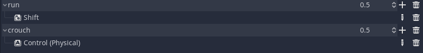

# Tutorial 7 - Game Development 2023/2024

> Godot Version: 3.5.3

## Sprinting & crouching

Melalui fitur ini, `Player` dapat memilih untuk jalan dengan kecepatan normal, berlari, atau berjalan sambil jongkok dengan kecepatan yang lebih lambat dari biasanya. Untuk mengimplementasikan hal ini, saya menambahkan `action` pada `Input Map` sebagai berikut.



Kemudian, saya menyesuaikan `Player.gd` script sebagai berikut.

```py
extends KinematicBody

...

export var run_speed_multiplier = 2
export var crouch_speed_multiplier = 0.5

...

func _physics_process(delta):
    ...

    movement_vector = movement_vector.normalized()

    if Input.is_action_pressed("run"):
        movement_vector *= run_speed_multiplier
    elif Input.is_action_pressed("crouch"):
        movement_vector *= crouch_speed_multiplier

    ...

    velocity = move_and_slide(velocity, Vector3.UP)
```

Melalui script di atas, ketika `Player` menekan tombol `Shift` untuk run, `movement_vector` akan diperbesar sebanyak 2 kali. Di sisi lain, ketika `Player` menekan tombol `Ctrl` untuk crouch, `movement_vector` akan diperkecil menjadi setengahnya (0.5 dari `movement_vector` awal).

## Sumber Referensi
